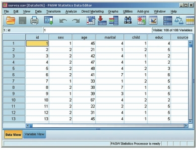
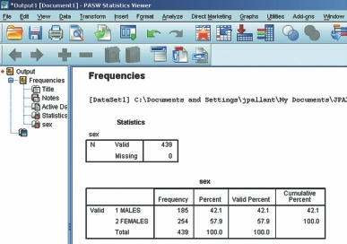
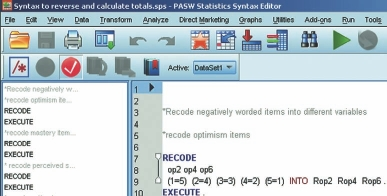

# Làm Quen Với SPSS (Getting to Know SPSS)

Phần mềm SPSS (Statistical Package for the Social Sciences) cung cấp môi trường làm việc trực quan cho phân tích số liệu. Để thao tác thành thạo, bạn cần nắm rõ 4 cửa sổ chính của phần mềm.

---

## 1. Cửa Sổ Dữ Liệu (Data Editor)

Cửa sổ Data Editor gồm 2 thẻ (Tab) chính nằm ở góc dưới bên trái:



1. **Data View:** Hiển thị bảng dữ liệu thực tế.
   - Mỗi **dòng (row)** đại diện cho một đối tượng/quan sát ($N$).
   - Mỗi **cột (column)** đại diện cho một biến số.
2. **Variable View:** Nơi khai báo và cấu hình thuộc tính của tất cả các biến số.



---

## 2. Cửa Sổ Kết Quả (Output Viewer)

Tất cả các bảng biểu, đồ thị và kết quả kiểm định thống kê khi chạy lệnh sẽ xuất hiện ở cửa sổ **Output Viewer** (tệp `.spv`).



- **Cột khung bên trái (Outline Pane):** Hiển thị mục lục cấu trúc cây của các lệnh đã chạy.
- **Khung bên phải (Display Pane):** Hiển thị nội dung chi tiết các bảng kết quả và đồ thị.
- Bạn có thể nhấp đúp chuột vào bất kỳ bảng nào trong Output để chỉnh sửa phông chữ, định dạng hoặc ẩn/hiện hàng cột.

---

## 3. Cửa Sổ Câu Lệnh (Syntax Editor)

Ngoài thao tác bằng menu kéo thả, SPSS cho phép lưu và chạy các câu lệnh dưới dạng mã lệnh văn bản (Syntax, tệp `.sps`).

```sps
* Ví dụ lệnh tính thống kê mô tả biến age và sex.
FREQUENCIES VARIABLES=sex educ
  /ORDER=ANALYSIS.

DESCRIPTIVES VARIABLES=age
  /STATISTICS=MEAN STDDEV MIN MAX.
```

> **Mẹo:** Trong các hộp thoại lệnh của SPSS, bạn có thể nhấn nút **Paste** thay vì OK để dán câu lệnh vào Syntax Editor. Việc này giúp bạn lưu lại nhật ký phân tích và tái sử dụng cho các lần sau.
