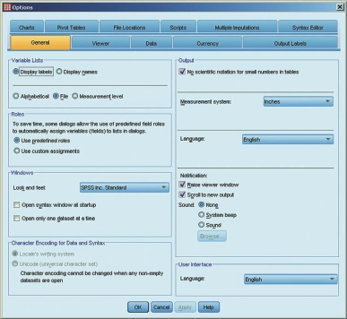
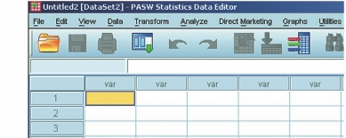
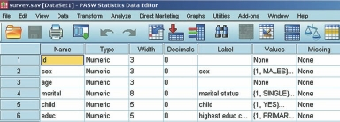

# Tạo Tệp Dữ Liệu Và Nhập Dữ Liệu (Creating a Data File & Entering Data)

Sau khi chuẩn bị xong Sổ mã hóa (Codebook), bạn sẽ tiến hành khai báo cấu trúc biến và nhập số liệu trong SPSS.

---

## 1. Cấu Hình Thuộc Tính Biến Trong Variable View

Trong thẻ **Variable View**, mỗi hàng tương ứng với một biến số với 11 cột thuộc tính:

1. **Name:** Tên ngắn của biến (ví dụ: `age`, `sex`).
2. **Type:** Kiểu dữ liệu. Thường chọn `Numeric` (dạng số) cho hầu hết các biến. Chọn `String` nếu là chuỗi chữ.
3. **Width:** Độ rộng tối đa của ký tự nhập vào.
4. **Decimals:** Số chữ số thập phân hiển thị (mặc định là 2).
5. **Label:** Nhãn mô tả đầy đủ của biến.
6. **Values:** Gán mã số cho các giá trị định tính (ví dụ: `1` = `Nam`, `2` = `Nữ`).
7. **Missing:** Khai báo các giá trị quy định là dữ liệu khuyết (ví dụ: `99`, `999`).
8. **Columns:** Độ rộng cột hiển thị trong Data View.
9. **Align:** Căn lề (`Right`, `Left`, `Center`).
10. **Measure:** Thang đo (`Scale`, `Ordinal`, `Nominal`).
11. **Role:** Vai trò (`Input`, `Target`, `Both`...).

---

## 2. Thao Tác Gán Giá Trị (Value Labels)

Để gán nhãn cho các giá trị trong cột **Values**:

1. Nhấp vào ô Values của biến tương ứng, chọn biểu tượng 3 dấu chấm `...`.
2. Nhập số vào ô **Value** (ví dụ: `1`).
3. Nhập chữ vào ô **Label** (ví dụ: `Nam`).
4. Nhấn **Add**, tiếp tục cho các giá trị khác (`2` = `Nữ`), sau đó nhấn **OK**.

---

## 3. Nhập Dữ Liệu Từ Tệp Excel

Nếu dữ liệu đã được nhập sẵn trên Excel (`.xlsx`), bạn có thể mở trực tiếp vào SPSS:

1. Chọn menu **File** $\r\rightarrow$ **Open** $\r\rightarrow$ **Data...**
2. Tại mục _Files of type_, chọn **Excel (_.xls, _.xlsx)**.
3. Chọn tệp cần mở và nhấn **Open**.
4. Tích chọn **Read variable names from first row of data** nếu dòng đầu tiên trên Excel là tên biến.
5. Nhấn **OK**.

