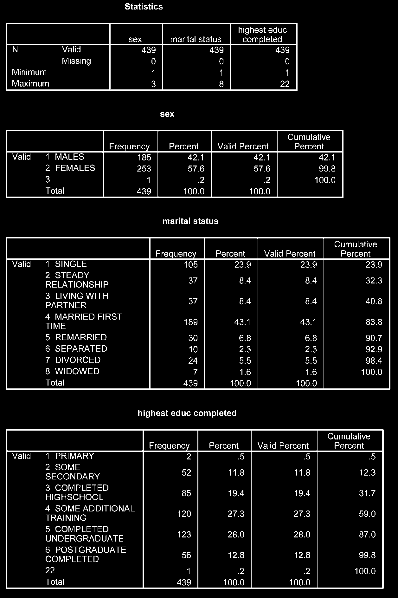
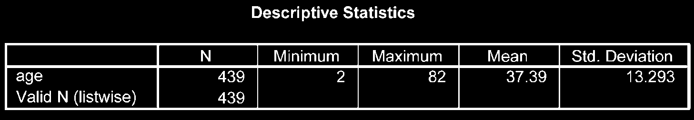

# Kiểm Tra Và Làm Sạch Dữ Liệu (Screening & Cleaning Data)

Trước khi thực hiện bất kỳ phân tích thống kê nào, dữ liệu cần phải được kiểm tra kỹ lưỡng nhằm phát hiện và sửa chữa các lỗi nhập liệu (như nhập sai số, nhập ngoài khoảng cho phép).

---

## 1. Quy Trình Kiểm Tra Biến Định Tính (Categorical Variables)

Đối với các biến định tính (như giới tính, học vấn), kiểm tra bằng lệnh **Frequencies**:

1. Vào menu **Analyze** $\r\rightarrow$ **Descriptive Statistics** $\r\rightarrow$ **Frequencies...**
2. Đưa các biến định tính vào ô _Variable(s)_.
3. Nhấn **OK**.

**Cách đọc kết quả:**

- Kiểm tra bảng Frequencies xem có xuất hiện giá trị lạ không (ví dụ: biến giới tính chỉ quy định 1 và 2 nhưng kết quả xuất hiện giá trị `3` hoặc `5`).
- Kiểm tra số lượng dữ liệu khuyết (Missing).

---

## 2. Quy Trình Kiểm Tra Biến Liên Tục (Continuous Variables)

Đối với biến liên tục (như tuổi, cân nặng, điểm số), sử dụng lệnh **Descriptives** hoặc **Explore**:

1. Vào menu **Analyze** $\r\rightarrow$ **Descriptive Statistics** $\r\rightarrow$ **Descriptives...**
2. Đưa các biến liên tục vào ô _Variable(s)_.
3. Chọn **Options...**, tích chọn **Mean**, **Std. deviation**, **Minimum**, **Maximum**.
4. Nhấn **Continue** $\r\rightarrow$ **OK**.

**Phát hiện bất thường:**

- So sánh giá trị **Minimum** và **Maximum** với khoảng hợp lệ thực tế (ví dụ: biến tuổi có `Min = 2` và `Max = 150` thì giá trị `150` chắc chắn là lỗi nhập liệu).

---

## 3. Định Vị Và Sửa Lỗi Trong Data Editor

Khi phát hiện có lỗi nhập liệu (ví dụ: biến tuổi nhập sai thành 150 ở một đối tượng):

1. Vào menu **Edit** $\r\rightarrow$ **Find...** (hoặc nhấn `Ctrl + F`).
2. Nhập giá trị lỗi (`150`) và tìm kiếm cột biến tương ứng để sửa lại giá trị đúng hoặc chuyển thành dữ liệu khuyết.
