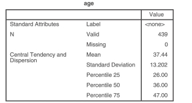
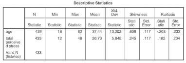
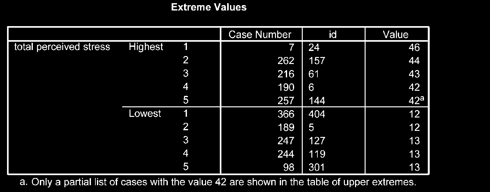

# Thống Kê Mô Tả (Descriptive Statistics)

Thống kê mô tả được sử dụng để tóm tắt các đặc tính của mẫu nghiên cứu, cung cấp cái nhìn tổng quan về đặc điểm dân số học và các chỉ số đo lường.

---

## 1. Thống Kê Mô Tả Biến Định Tính (Categorical Variables)

Sử dụng lệnh **Frequencies** để tính tần số ($N$) và tỷ lệ phần trăm (%):

1. **Analyze** $\r\rightarrow$ **Descriptive Statistics** $\r\rightarrow$ **Frequencies...**
2. Chọn biến cần mô tả vào ô _Variable(s)_.
3. Nhấn **OK**.

---

## 2. Thống Kê Mô Tả Biến Liên Tục (Continuous Variables)

Sử dụng lệnh **Explore** để có cái nhìn chi tiết và toàn diện về phân phối dữ liệu:

1. **Analyze** $\r\rightarrow$ **Descriptive Statistics** $\r\rightarrow$ **Explore...**
2. Đưa biến liên tục vào ô _Dependent List_.
3. Đưa biến phân nhóm (nếu có, như giới tính) vào ô _Factor List_.
4. Chọn nút **Plots...**, tích chọn **Normality plots with tests** (để kiểm định phân phối chuẩn) và **Histogram**.
5. Nhấn **Continue** $\r\rightarrow$ **OK**.

---

## 3. Đánh Giá Phân Phối Chuẩn (Normality)

Khi phân tích biến liên tục, việc đánh giá dữ liệu có phân phối chuẩn hay không quyết định việc chọn phép kiểm tham số hay phi tham số:

| Chỉ Số / Phép Kiểm             | Tiêu Chí Phân Phối Chuẩn         | Ý Nghĩa / Phiên Giải                                                    |
| :----------------------------- | :------------------------------- | :---------------------------------------------------------------------- |
| **Giá trị Skewness (Độ lệch)** | Gần bằng 0 (khoảng từ -1 đến +1) | Lệch phải nếu $> 0$, lệch trái nếu $< 0$.                                 |
| **Giá trị Kurtosis (Độ nhọn)** | Gần bằng 0 (khoảng từ -1 đến +1) | Nhọn nếu $> 0$, bẹt nếu $< 0$.                                            |
| **5% Trimmed Mean**            | Tương đương giá trị **Mean** gốc | Cho thấy các giá trị ngoại lệ (Outliers) không làm méo lệch trung bình. |
| **Kolmogorov-Smirnov Test**    | $P > .05$ ($Sig. > .05$)         | Dữ liệu có phân phối chuẩn (mẫu $N > 50$).                              |
| **Shapiro-Wilk Test**          | $P > .05$ ($Sig. > .05$)         | Dữ liệu có phân phối chuẩn (mẫu nhỏ $N < 50$).                          |

