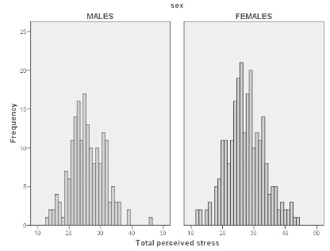
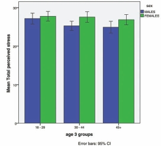
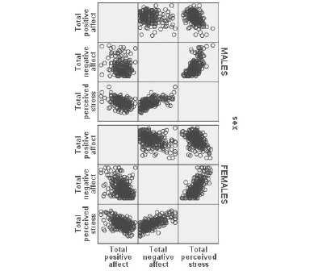

# Sử Dụng Đồ Thị Trong SPSS (Using Graphs)

Đồ thị là công cụ hiệu quả giúp trực quan hóa sự phân bố của dữ liệu, so sánh giữa các nhóm và phát hiện mối quan hệ giữa các biến.

---

## 1. Biểu Đồ Cột (Bar Chart)

Dùng cho biến định tính hoặc so sánh giá trị trung bình giữa các nhóm:

1. **Graphs** $\r\rightarrow$ **Chart Builder...**
2. Tại mục _Gallery_, chọn **Bar**, kéo kiểu biểu đồ mong muốn vào khung xem trước.
3. Kéo biến phân nhóm vào trục X, biến liên tục hoặc tần số vào trục Y.
4. Nhấn **OK**.

---

## 2. Biểu Đồ Hộp (Boxplot)

Biểu đồ hộp thể hiện trung vị (Median), khoảng tứ phân vị (IQR) và các giá trị ngoại lệ (Outliers):

- **Đường ngang giữa hộp:** Giá trị Trung vị (Median / $Q_2$).
- **Cạnh dưới & cạnh trên của hộp:** Tương ứng $Q_1$ (bách phân vị 25) và $Q_3$ (bách phân vị 75).
- **Các điểm tròn/dấu sao ngoài râu:** Các giá trị dị biệt/ngoại lệ (Outliers / Extremes).

---

## 3. Biểu Đồ Phân Tán (Scatterplot)

Dùng để kiểm tra mối quan hệ tuyến tính giữa 2 biến liên tục trước khi chạy tương quan Pearson hoặc Hồi quy:

1. **Graphs** $\r\rightarrow$ **Chart Builder...**
2. Chọn **Scatter/Dot** $\r\rightarrow$ **Simple Scatter**.
3. Kéo biến độc lập vào trục X, biến phụ thuộc vào trục Y.
4. Nhấn **OK**.

