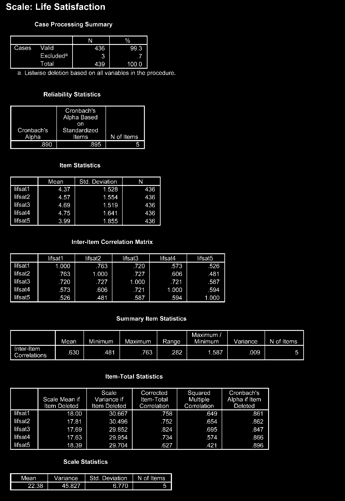

# Kiểm Tra Độ Tin Cậy Thang Đo (Checking Scale Reliability)

Khi sử dụng thang đo gồm nhiều item (câu hỏi) để đo lường một khái niệm tiềm ẩn (như _Mức độ trầm cảm_, _Sự hài lòng_), bạn phải kiểm tra độ tin cậy nhất quán nội tại (Internal Consistency) bằng hệ số **Cronbach's Alpha**.

---

## 1. Các Bước Thực Hiện Trong SPSS

1. Vào menu **Analyze** $\r\rightarrow$ **Scale** $\r\rightarrow$ **Reliability Analysis...**
2. Đưa các item câu hỏi của thang đo vào ô _Items_.
3. Mục _Model_, giữ mặc định là **Alpha**.
4. Chọn nút **Statistics...**:
   - Tại mục _Descriptives for_, tích chọn: **Item**, **Scale**, **Scale if item deleted**.
   - Tại mục _Inter-Item_, tích chọn **Correlations**.
5. Nhấn **Continue** $\r\rightarrow$ **OK**.

---

## 2. Tiêu Chí Đánh Giá Kết Quả Output

### 1. Hệ số Cronbach's Alpha ($lpha$)

- **$lpha \ge 0.8$:** Độ tin cậy rất tốt.
- **$0.7 \le lpha < 0.8$:** Độ tin cậy đạt yêu cầu chấp nhận được.
- **$0.6 \le lpha < 0.7$:** Đạt yêu cầu trong các nghiên cứu khám phá sơ bộ.
- **$lpha < 0.6$:** Thang đo không đạt độ tin cậy, cần loại bỏ biến hoặc thiết kế lại.

### 2. Tương quan biến - tổng (Corrected Item-Total Correlation)

- Mỗi item phải có hệ số tương quan biến - tổng $\ge 0.30$.
- Nếu một item có $Corrected\ Item-Total\ Correlation < 0.30$, item đó đo lường không nhất quán với thang đo chung và nên xem xét loại bỏ.

### 3. Cronbach's Alpha if Item Deleted

- Nếu xóa item mà hệ số Cronbach's Alpha chung tăng lên đáng kể, đó là dấu hiệu nên loại bỏ item đó để nâng cao chất lượng thang đo.
