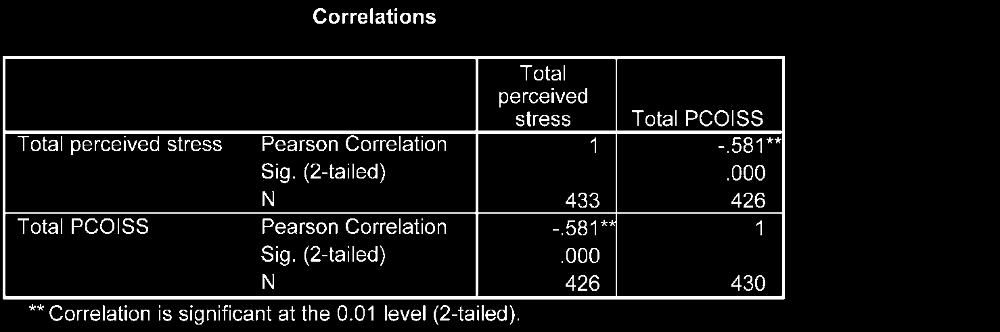
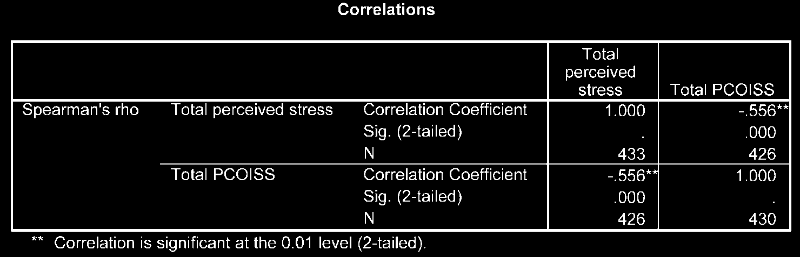

# Phân Tích Hệ Số Tương Quan (Correlation)

Phân tích tương quan được sử dụng để đánh giá độ mạnh và hướng của mối quan hệ tuyến tính giữa hai biến liên tục.

---

## 1. Hệ Số Tương Quan Pearson ($r$)

Hệ số tương quan Pearson ($r$) nhận giá trị từ **-1.0** đến **+1.0**:

- **$r = +1.0$:** Tương quan thuận hoàn hảo.
- **$r = 0$:** Không có mối quan hệ tuyến tính.
- **$r = -1.0$:** Tương quan nghịch hoàn hảo.

### Đánh giá độ mạnh theo Cohen (1988):

- **$r = .10$ đến $.29$:** Tương quan yếu (Small).
- **$r = .30$ đến $.49$:** Tương quan trung bình (Medium).
- **$r = .50$ đến $1.0$:** Tương quan mạnh (Large).

---

## 2. Các Bước Thực Hiện Trong SPSS

1. **Analyze** $\r\rightarrow$ **Correlate** $\r\rightarrow$ **Bivariate...**
2. Chọn 2 hoặc nhiều biến liên tục đưa vào ô _Variables_.
3. Tại mục _Correlation Coefficients_:
   - Tích chọn **Pearson** (nếu dữ liệu phân phối chuẩn).
   - Tích chọn **Spearman** (nếu dữ liệu không phân phối chuẩn hoặc dạng xếp hạng).
4. Tích chọn **Flag significant correlations**.
5. Nhấn **OK**.

---

## 3. Phiên Giải Kết Quả Output

- **Pearson Correlation ($r$):** Giá trị hệ số tương quan giữa 2 biến.
- **Sig. (2-tailed) ($P$):** Mức ý nghĩa thống kê. Nếu $P < .05$, mối tương quan có ý nghĩa thống kê.
- **N:** Số lượng mẫu hợp lệ.

> **Mẫu trình bày APA:**
> _Có mối tương quan thuận mạnh có ý nghĩa thống kê giữa độ tuổi và mức độ lo âu ($r = .54, n = 435, P < .001$). Hệ số xác định $r^2 = .29$ cho thấy độ tuổi giải thích 29% biến thiên của điểm số lo âu._
