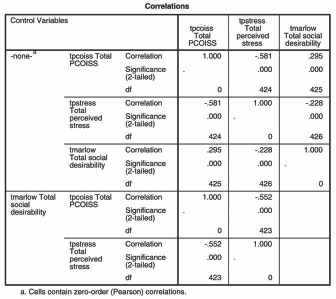

# Tương Quan Từng Phần (Partial Correlation)

Tương quan từng phần giúp đánh giá mối quan hệ thực sự giữa 2 biến liên tục sau khi đã **kiểm soát / loại bỏ ảnh hưởng (control for)** của một hoặc nhiều biến thứ ba.

---

## 1. Ví Dụ Ứng Dụng

Khi nghiên cứu mối tương quan giữa _Tốc độ đọc_ và _Kích thước bàn chân_ ở trẻ em, kết quả cho thấy tương quan thuận rất cao. Tuy nhiên, mối tương quan này bị nhiễu bởi biến thứ ba là _Độ tuổi_. Sau khi loại bỏ ảnh hưởng của _Độ tuổi_, mối tương quan giữa tốc độ đọc và kích thước bàn chân sẽ biến mất.

---

## 2. Các Bước Thực Hiện Trong SPSS

1. **Analyze** $\r\rightarrow$ **Correlate** $\r\rightarrow$ **Partial...**
2. Đưa 2 biến cần nghiên cứu tương quan vào ô _Variables_.
3. Đưa biến cần kiểm soát (nhiễu) vào ô _Controlling for_.
4. Chọn **Options...**, tích chọn **Means and standard deviations** và **Zero-order correlations** (để so sánh tương quan trước và sau khi kiểm soát).
5. Nhấn **Continue** $\r\rightarrow$ **OK**.

---

## 3. Phiên Giải Kết Quả

So sánh hệ số tương quan chưa kiểm soát (**Zero-order correlation**) và hệ số tương quan từng phần (**Partial correlation**):

- Nếu hệ số tương quan giảm đi đáng kể hoặc mất ý nghĩa thống kê ($P > .05$), mối quan hệ ban đầu phần lớn do biến thứ ba chi phối.
- Nếu hệ số tương quan hầu như không thay đổi, mối quan hệ giữa 2 biến chính là độc lập thực sự.
