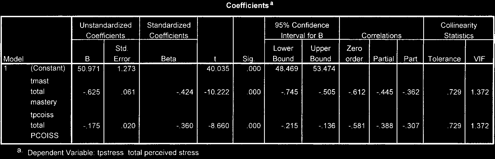
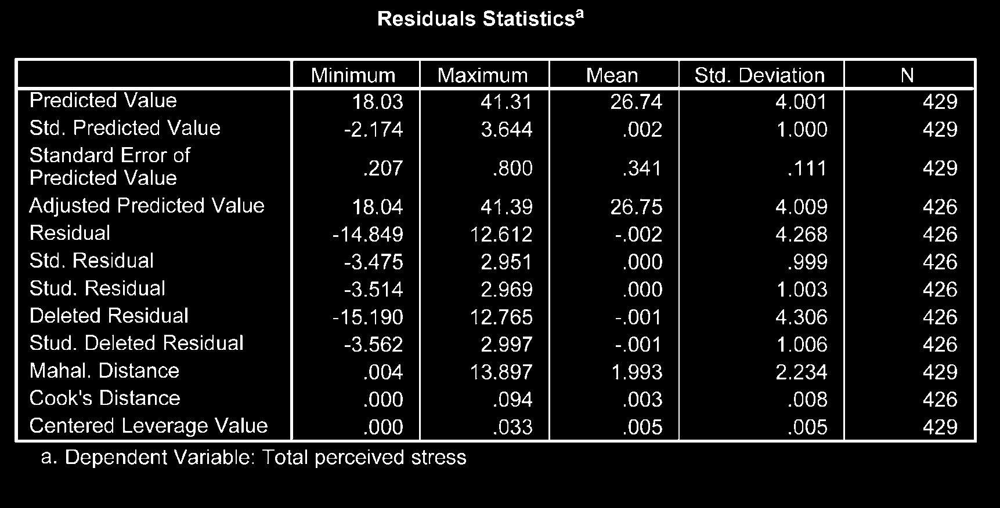

# Phân Tích Hồi Quy Bội (Multiple Regression)

Hồi quy bội được sử dụng để dự báo giá trị của một biến phụ thuộc liên tục dựa trên giá trị của nhiều biến độc lập, đồng thời xác định mức độ đóng góp tương đối của từng biến độc lập.

---

## 1. Kiểm Tra Các Giả Định Hồi Quy

Trước khi phiên giải mô hình hồi quy, cần kiểm tra các giả định nghiêm ngặt:

1. **Kích thước mẫu:** Khuyến nghị tối thiểu $N \ge 50 + 8m$ ($m$ là số biến độc lập).
2. **Đa cộng tuyến (Multicollinearity):** Tương quan giữa các biến độc lập không được quá cao ($r < .90$).
   - **Tolerance > 0.10**
   - **VIF < 10** (tốt nhất VIF < 5)
3. **Phân phối chuẩn, tuyến tính & Phương sai đồng nhất của phần dư:** Quan sát biểu đồ _Normal P-P Plot_ và _Scatterplot_ của phần dư.

---

## 2. Các Bước Thực Hiện Trong SPSS

1. **Analyze** $\r\rightarrow$ **Regression** $\r\rightarrow$ **Linear...**
2. Đưa biến phụ thuộc vào ô _Dependent_.
3. Đưa các biến độc lập vào ô _Block 1 of 1 (Independents)_.
4. Chọn nút **Statistics...**:
   - Tích chọn **Estimates**, **Model fit**, **R squared change**, **Descriptives**, **Collinearity diagnostics**.
5. Chọn nút **Plots...**:
   - Kéo `*ZRESID` vào ô Y, `*ZPRED` vào ô X.
   - Tích chọn **Histogram** và **Normal probability plot**.
6. Nhấn **Continue** $\r\rightarrow$ **OK**.

---

## 3. Đọc Và Phiên Giải Kết Quả Output

1. **Đánh giá độ phù hợp mô hình (Model Summary):**
   - **$R^2$ (R Square):** Tỷ lệ phần trăm biến thiên của biến phụ thuộc được giải thích bởi mô hình.
   - **Adjusted $R^2$:** Hệ số $R^2$ hiệu chỉnh theo số lượng biến độc lập.
2. **Kiểm định mức ý nghĩa tổng thể (ANOVA):**
   - Giá trị $F$ và $Sig.$ ($P$). Nếu $P < .05$, mô hình hồi quy có ý nghĩa thống kê.
3. **Đánh giá trọng số đóng góp từng biến (Coefficients):**
   - **Standardized Beta ($eta$):** Trọng số chuẩn hóa giúp so sánh độ mạnh tác động giữa các biến độc lập (biến nào có $|eta|$ lớn nhất là tác động mạnh nhất).
   - **Giá trị $t$ và $Sig.$ ($P$):** Xác định biến độc lập đó có đóng góp có ý nghĩa vào mô hình hay không ($P < .05$).
