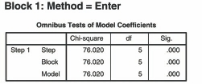
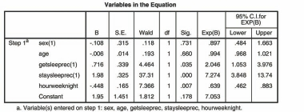

# Phân Tích Hồi Quy Logistic (Logistic Regression)

Hồi quy Logistic nhị phân (Binary Logistic Regression) được sử dụng khi **biến phụ thuộc là biến định tính 2 giá trị / nhị phân** (ví dụ: `0 = Không mắc bệnh`, `1 = Mắc bệnh`; `0 = Không đỗ`, `1 = Đỗ`).

---

## 1. Các Bước Thực Hiện Trong SPSS

1. **Analyze** $\r\rightarrow$ **Regression** $\r\rightarrow$ **Binary Logistic...**
2. Đưa biến phụ thuộc nhị phân vào ô _Dependent_.
3. Đưa các biến độc lập (liên tục hoặc định tính) vào ô _Covariates_.
4. Nếu có biến độc lập là biến định tính, chọn nút **Categorical...**, đưa biến đó vào ô _Categorical Covariates_ $\r\rightarrow$ chọn _Change_.
5. Chọn nút **Options...**:
   - Tích chọn **CI for exp(B): 95%**, **Hosmer-Lemeshow goodness-of-fit**, **Casewise listing of residuals**.
6. Nhấn **Continue** $\r\rightarrow$ **OK**.

---

## 2. Phiên Giải Kết Quả Output

1. **Kiểm định độ phù hợp mô hình Hosmer and Lemeshow Test:**
   - Cần giá trị $P > .05$ ($Sig. > .05$) để kết luận mô hình phù hợp tốt với dữ liệu thực tế.
2. **Hệ số xác định tương đương:**
   - **Cox & Snell $R^2$** và **Nagelkerke $R^2$** cung cấp thông tin về tỷ lệ biến thiên được giải thích.
3. **Bảng Các Biến Trong Mô Hình (Variables in the Equation):**
   - **$B$:** Hệ số hồi quy chưa chuẩn hóa.
   - **Wald:** Kiểm định ý nghĩa thống kê của biến độc lập ($P < .05$).
   - **$Exp(B)$ (Odds Ratio - OR):** Tỷ số chênh.
     - $OR > 1$: Làm tăng xác suất xảy ra biến cố.
     - $OR < 1$: Làm giảm xác suất xảy ra biến cố.
     - **95% CI for EXP(B):** Khoảng tin cậy 95% của Tỷ số chênh OR.
