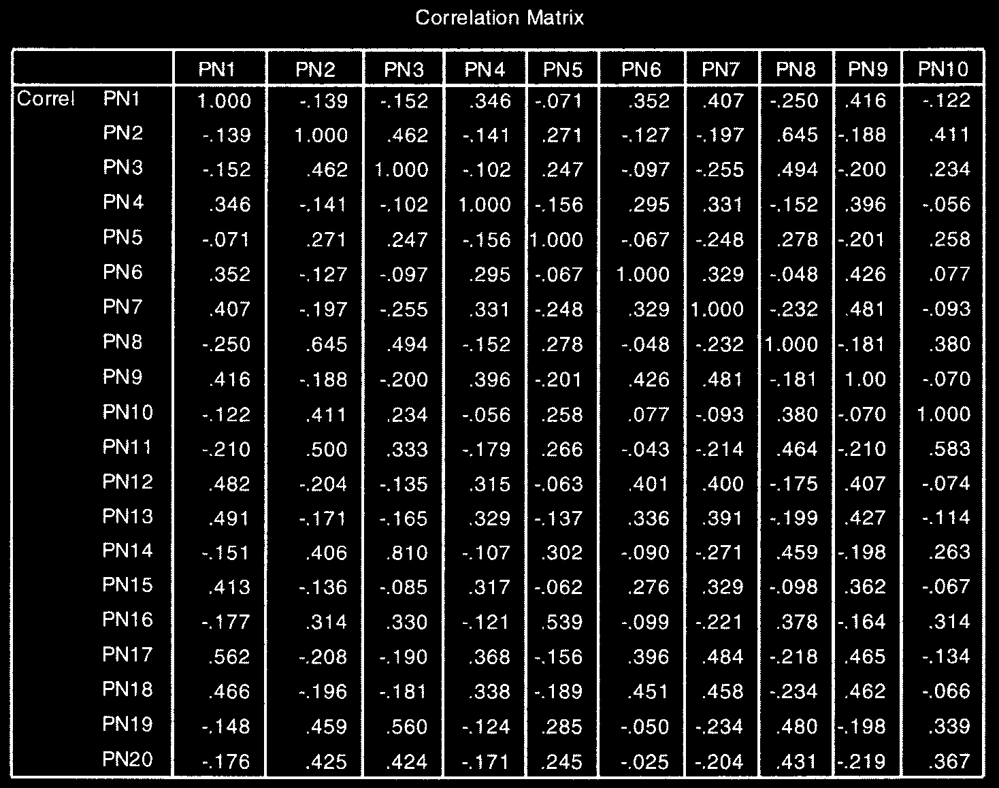
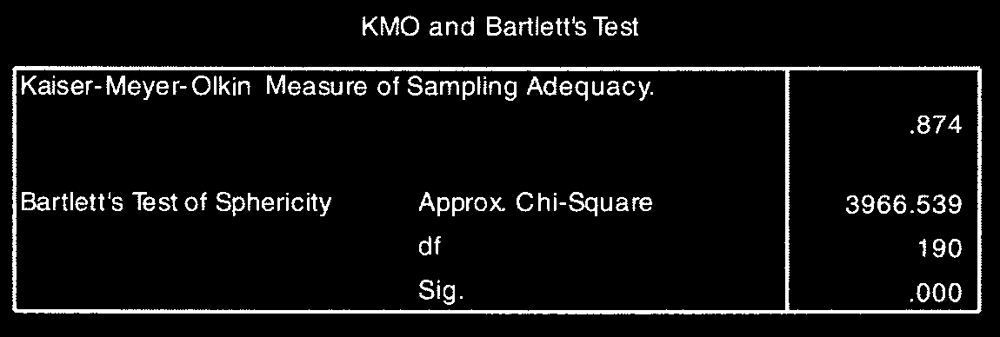

# Phân Tích Nhân Tố Khám Phá (Factor Analysis - EFA)

Phân tích nhân tố khám phá (Exploratory Factor Analysis - EFA) là kỹ thuật thu gom nhóm một tập hợp gồm nhiều biến quan sát (items) thành một số ít các **nhân tố (factors / components)** đại diện có bản chất chung.

---

## 1. Điều Kiện Áp Dụng EFA

- **Kích thước mẫu:** Tối thiểu 5 quan sát cho 1 biến ($N \ge 5 \times \text{số items}$), tốt nhất $N \ge 150$.
- **Chỉ số KMO (Kaiser-Meyer-Olkin):** $0.5 \le \text{KMO} \le 1.0$ (tốt nhất $\ge 0.6$).
- **Kiểm định Bartlett (Bartlett's Test of Sphericity):** Giá trị $P < .05$.
- **Hệ số tải nhân tố (Factor Loading):** Các item cần có Factor Loading $\ge 0.40$ (hoặc $\ge 0.50$).

---

## 2. Các Bước Thực Hiện Trong SPSS

1. **Analyze** $\r\rightarrow$ **Dimension Reduction** $\r\rightarrow$ **Factor...**
2. Chọn tất cả các biến quan sát cần phân tích vào ô _Variables_.
3. Chọn nút **Descriptives...**: tích chọn **KMO and Bartlett's test of sphericity** và **Anti-image**.
4. Chọn nút **Extraction...**:
   - Method: **Principal components**.
   - Extract: tích chọn **Based on Eigenvalue** ($> 1$).
   - Tích chọn **Scree plot**.
5. Chọn nút **Rotation...**:
   - Chọn **Varimax** (xoay vuông góc nếu các nhân tố độc lập) hoặc **Direct Oblimin** (xoay xéo nếu các nhân tố có tương quan).
6. Chọn nút **Options...**: tích chọn **Sorted by size** và **Suppress small coefficients** (nhập `0.30` hoặc `0.40` để ẩn hệ số nhỏ).
7. Nhấn **Continue** $\r\rightarrow$ **OK**.

---

## 3. Phiên Giải Kết Quả EFA

1. **KMO & Bartlett's Test:** Đảm bảo $ ext{KMO} \ge 0.6$ và $P < .001$.
2. **Total Variance Explained (Tổng phương sai trích):** Cần đạt $\ge 50\%$ (mô hình giải thích được từ 50% biến thiên trở lên) tại các nhân tố có Eigenvalue $> 1$.
3. **Rotated Component Matrix (Ma trận nhân tố xoay):**
   - Kiểm tra các biến tải lên nhân tố nào.
   - Loại bỏ các biến bị tải kép (Cross-loading trên 2 nhân tố với khoảng chênh $< 0.30$) hoặc không đạt tiêu chuẩn loading.
