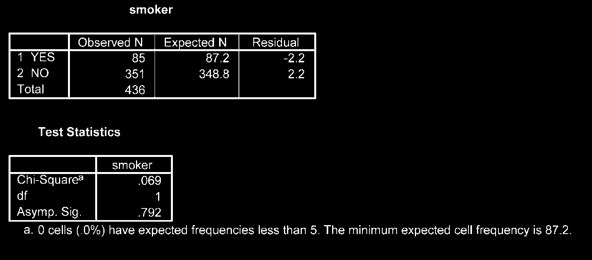
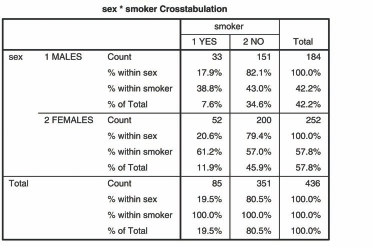

# Thống Kê Phi Tham Số (Non-Parametric Statistics)

Các kiểm định phi tham số không đòi hỏi giả định về phân phối chuẩn của dữ liệu hay thang đo liên tục khắt khe, phù hợp cho mẫu nhỏ hoặc dữ liệu dạng thứ bậc (Ordinal).

---

## 1. Tổng Hợp Các Kiểm Định Phi Tham Số

| Phép Kiểm Phi Tham Số          | Phép Kiểm Tham Số Tương Ứng | Mục Đích Sử Dụng                          |
| :----------------------------- | :-------------------------- | :---------------------------------------- |
| **Chi-square Test ($\chi^2$)** | -                           | Mối liên quan giữa 2 biến định tính.      |
| **Mann-Whitney U Test**        | Independent-samples t-test  | So sánh 2 nhóm độc lập (mẫu không chuẩn). |
| **Wilcoxon Signed-Rank Test**  | Paired-samples t-test       | So sánh 2 thời điểm lặp lại / cặp ghép.   |
| **Kruskal-Wallis Test**        | One-way ANOVA               | So sánh $\ge 3$ nhóm độc lập.             |
| **Friedman Test**              | One-way Repeated ANOVA      | So sánh $\ge 3$ thời điểm lặp lại.        |

---

## 2. Kiểm Định Chi-Square ($\chi^2$) Khi Cặp Biến Định Tính

1. **Analyze** $\r\rightarrow$ **Descriptive Statistics** $\r\rightarrow$ **Crosstabs...**
2. Chọn biến dòng vào _Row(s)_, biến cột vào _Column(s)_.
3. Chọn nút **Statistics...**: tích chọn **Chi-square**, **Phi and Cramer's V**.
4. Chọn nút **Cells...**: tích chọn **Observed**, **Expected**, và phần trăm **Row / Column**.
5. Nhấn **Continue** $\r\rightarrow$ **OK**.

**Điều kiện áp dụng:** Không có ô nào có tần số kỳ vọng (Expected Count) $< 5$ quá 20% tổng số ô, và không ô nào $< 1$.

---

## 3. Kiểm Định Mann-Whitney U Test

1. **Analyze** $\r\rightarrow$ **Nonparametric Tests** $\r\rightarrow$ **Legacy Dialogs** $\r\rightarrow$ **2 Independent Samples...**
2. Đưa biến định lượng vào _Test Variable List_, biến phân nhóm vào _Grouping Variable_.
3. Khai báo 2 mã nhóm tại _Define Groups..._ (ví dụ: `1` và `2`).
4. Nhấn **OK**.

