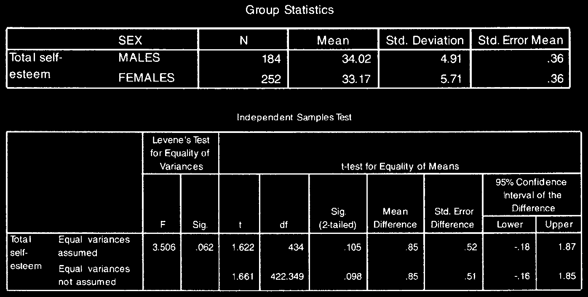

# Kiểm Định So Sánh Trung Bình T-Tests

Phép kiểm T-test được sử dụng để so sánh giá trị trung bình (Mean) của biến phụ thuộc liên tục giữa hai nhóm độc lập hoặc hai thời điểm lặp lại.

---

## 1. Independent-Samples T-Test (So Sánh 2 Nhóm Độc Lập)

Dùng khi so sánh giá trị trung bình giữa 2 nhóm tách biệt (ví dụ: Nam vs Nữ; Nhóm can thiệp vs Nhóm chứng).

### Các bước thực hiện:

1. **Analyze** $\r\rightarrow$ **Compare Means** $\r\rightarrow$ **Independent-Samples T Test...**
2. Đưa biến phụ thuộc vào ô _Test Variable(s)_.
3. Đưa biến phân nhóm vào ô _Grouping Variable_, nhấn **Define Groups...** nhập `1` và `2`.
4. Nhấn **OK**.

### Đọc kết quả Output:

1. **Kiểm định Levene's Test for Equality of Variances:**
   - Nếu $P > .05$: Phương sai đồng nhất $\r\rightarrow$ đọc hàng **Equal variances assumed**.
   - Nếu $P \le .05$: Phương sai không đồng nhất $\r\rightarrow$ đọc hàng **Equal variances not assumed**.
2. **Giá trị $t$ và Sig. (2-tailed) ($P$):** Nếu $P < .05$, trung bình giữa 2 nhóm có sự khác biệt có ý nghĩa thống kê.
3. **Kích thước hiệu ứng Eta squared ($\eta^2$):**
   $$\eta^2 = \frac{t^2}{t^2 + (N_1 + N_2 - 2)}$$
   - $0.01$: Hiệu ứng nhỏ; $0.06$: Hiệu ứng trung bình; $0.14$: Hiệu ứng lớn.

---

## 2. Paired-Samples T-Test (So Sánh Cặp Ghép / Trước - Sau)

Dùng khi đo lường cùng một nhóm đối tượng qua 2 thời điểm (ví dụ: Điểm đau Trước điều trị vs Sau điều trị).

1. **Analyze** $\r\rightarrow$ **Compare Means** $\r\rightarrow$ **Paired-Samples T Test...**
2. Chọn cặp 2 biến đưa vào ô _Paired Variables_.
3. Nhấn **OK**.
