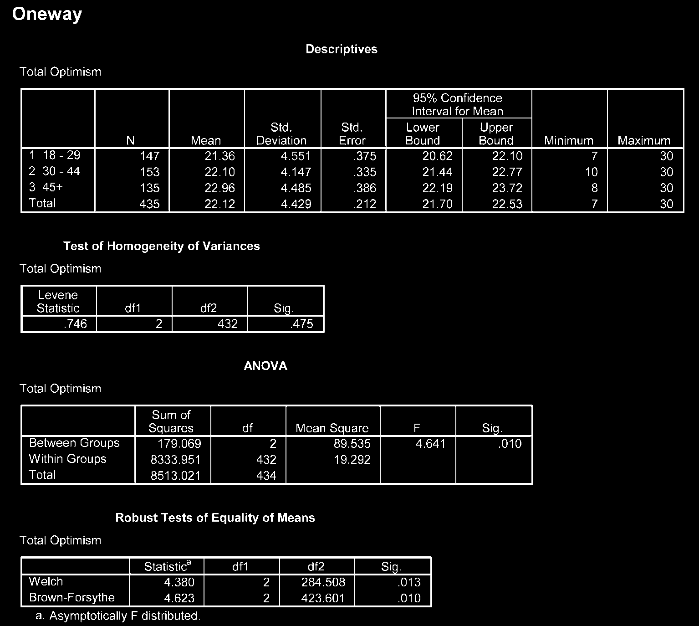
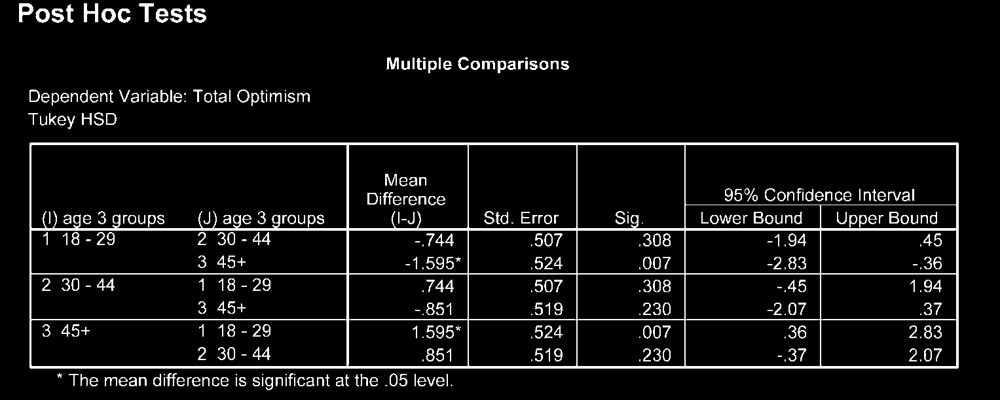

# Phân Tích Phương Sai Một Yếu Tố (One-Way ANOVA)

Phân tích phương sai một yếu tố (One-Way ANOVA) được sử dụng để so sánh giá trị trung bình của biến phụ thuộc liên tục giữa **từ 3 nhóm độc lập trở lên** (ví dụ: so sánh thu nhập giữa 3 nhóm trình độ học vấn: _THPT_, _Đại học_, _Sau Đại học_).

---

## 1. Các Bước Thực Hiện Trong SPSS

1. **Analyze** $\r\rightarrow$ **Compare Means** $\r\rightarrow$ **One-Way ANOVA...**
2. Đưa biến phụ thuộc liên tục vào ô _Dependent List_.
3. Đưa biến phân nhóm vào ô _Factor_.
4. Chọn nút **Post Hoc...**: tích chọn **Tukey** (nếu phương sai đồng nhất) hoặc **Games-Howell** (nếu phương sai không đồng nhất).
5. Chọn nút **Options...**: tích chọn **Descriptive**, **Homogeneity of variance test**, **Welch**.
6. Nhấn **Continue** $\r\rightarrow$ **OK**.

---

## 2. Phiên Giải Kết Quả Output

1. **Homogeneity of Variances Test (Levene test):** Xem $Sig. > .05$ để xác định tính đồng nhất phương sai.
2. **Bảng ANOVA chính:**
   - Giá trị $F$ và $Sig.$ ($P$). Nếu $P < .05$, có sự khác biệt ít nhất giữa 2 trong số các nhóm.
3. **Kiểm định so sánh bội Post-Hoc (Multiple Comparisons):**
   - Xác định chính xác cặp nhóm nào có sự khác biệt có ý nghĩa thống kê ($P < .05$).
4. **Tính Kích thước hiệu ứng Eta Squared ($\eta^2$):**
   $$\eta^2 = \frac{\text{Sum of Squares Between Groups}}{\text{Total Sum of Squares}}$$
