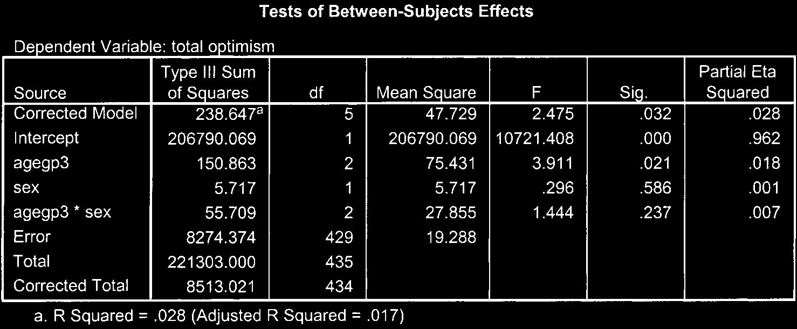

# Phân Tích Phương Sai Hai Yếu Tố (Two-Way Between-Groups ANOVA)

ANOVA hai yếu tố giúp nghiên cứu tác động của **hai biến độc lập định tính** cùng lúc lên một biến phụ thuộc liên tục, đồng thời kiểm tra **tác động tương tác (Interaction Effect)** giữa hai biến độc lập.

---

## 1. Ví Dụ Nghiên Cứu

Đánh giá ảnh hưởng của _Giới tính_ (Nam / Nữ) và _Trình độ học vấn_ (Thấp / Trung bình / Cao) lên _Mức độ căng thẳng công việc_.

---

## 2. Các Bước Thực Hiện Trong SPSS

1. **Analyze** $\r\rightarrow$ **General Linear Model** $\r\rightarrow$ **Univariate...**
2. Đưa biến phụ thuộc vào ô _Dependent Variable_.
3. Đưa 2 biến độc lập phân nhóm vào ô _Fixed Factor(s)_.
4. Chọn nút **Plots...**: kéo 1 biến vào _Horizontal Axis_, 1 biến vào _Separate Lines_ $\r\rightarrow$ chọn **Add**.
5. Chọn nút **Options...**:
   - Đưa các biến và tương tác vào ô _Display Means for_.
   - Tích chọn **Descriptive statistics**, **Estimates of effect size**, **Homogeneity tests**.
6. Nhấn **Continue** $\r\rightarrow$ **OK**.

---

## 3. Phiên Giải Kết Quả Output

1. **Tác động tương tác (Interaction Effect - `Factor1 * Factor2`):**
   - Kiểm tra hàng tương tác trong bảng _Tests of Between-Subjects Effects_.
   - Nếu $P < .05$, tác động của yếu tố thứ nhất lên biến phụ thuộc phụ thuộc vào mức độ của yếu tố thứ hai.
2. **Tác động chính (Main Effects):**
   - Đánh giá sự khác biệt của từng yếu tố độc lập độc lập với yếu tố còn lại.
3. **Chỉ số Partial Eta Squared ($\eta_p^2$):** Đánh giá mức độ đóng góp hiệu ứng.
