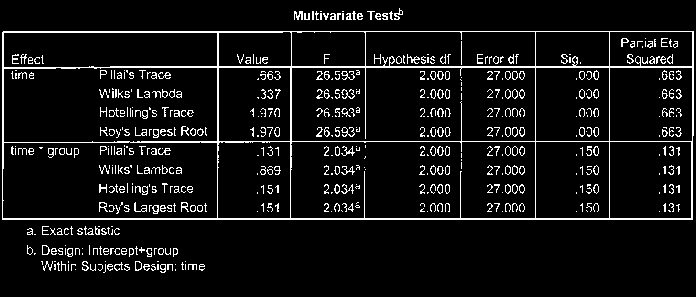

# Phân Tích Phương Sai Hỗn Hợp (Mixed Between-Within ANOVA)

Mixed ANOVA kết hợp cả yếu tố **so sánh giữa các nhóm độc lập (Between-subjects factor)** và yếu tố **đo lường lặp lại theo thời gian (Within-subjects factor)** trong cùng một phân tích.

---

## 1. Ví Dụ Ứng Dụng

Nghiên cứu so sánh hiệu quả của 2 _Phương pháp can thiệp_ (Nhóm A vs Nhóm B - Between) đến _Chỉ số trầm cảm_ được đo lường tại 3 thời điểm: _Trước can thiệp_, _Ngay sau can thiệp_, và _Theo dõi sau 3 tháng_ (Within).

---

## 2. Các Bước Thực Hiện Trong SPSS

1. **Analyze** $\r\rightarrow$ **General Linear Model** $\r\rightarrow$ **Repeated Measures...**
2. Đặt tên yếu tố lặp lại tại _Within-Subject Factor Name_ (ví dụ: `Time`), nhập số mức _Number of Levels_ (`3`) $\r\rightarrow$ chọn **Add** $\r\rightarrow$ chọn **Define**.
3. Đưa 3 biến thời điểm vào ô _Within-Subjects Variables_.
4. Đưa biến phân nhóm vào ô _Between-Subjects Factor(s)_.
5. Chọn **Options...**: tích chọn **Descriptive statistics**, **Estimates of effect size**, **Homogeneity tests**.
6. Nhấn **Continue** $\r\rightarrow$ **OK**.

