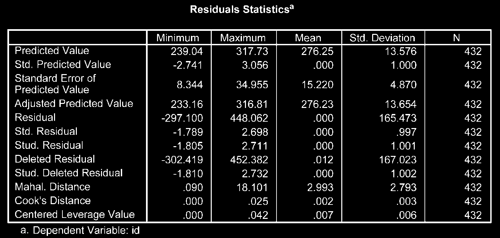
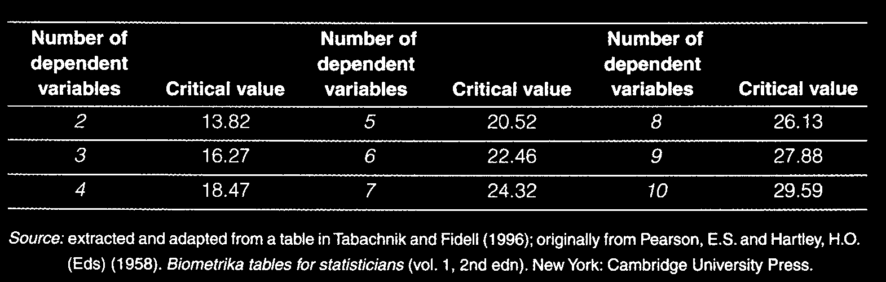

# Phân Tích Phương Sai Đa Biến (Multivariate ANOVA - MANOVA)

Phân tích phương sai đa biến (MANOVA) được sử dụng khi bạn có **một hoặc nhiều biến độc lập phân nhóm** và **từ hai biến phụ thuộc liên tục trở lên** có tương quan với nhau.

---

## 1. Ưu Điểm Của MANOVA So Với Nhiều ANOVA Đơn Lẻ

Khi kiểm tra sự khác biệt nhóm trên nhiều biến phụ thuộc liên tục, việc chạy nhiều lệnh ANOVA riêng lẻ sẽ làm gia tăng tỷ lệ sai sót loại I (Type I Error Rate). MANOVA giúp kiểm soát tỷ lệ sai sót này và phát hiện sự khác biệt trên tập hợp tổ hợp các biến phụ thuộc.

---

## 2. Các Bước Thực Hiện Trong SPSS

1. **Analyze** $\r\rightarrow$ **General Linear Model** $\r\rightarrow$ **Multivariate...**
2. Đưa các biến phụ thuộc liên tục vào ô _Dependent Variables_.
3. Đưa biến phân nhóm vào ô _Fixed Factor(s)_.
4. Chọn nút **Options...**:
   - Tích chọn **Descriptive statistics**, **Estimates of effect size**, **Homogeneity tests**.
5. Nhấn **Continue** $\r\rightarrow$ **OK**.

---

## 3. Phiên Giải Kết Quả Output

1. **Đánh giá chỉ số Wilks' Lambda (hoặc Pillai's Trace):**
   - Xem hàng Wilks' Lambda trong bảng _Multivariate Tests_. Nếu $P < .05$, có sự khác biệt có ý nghĩa thống kê giữa các nhóm trên tổ hợp các biến phụ thuộc.
2. **Kiểm định Levene's Test & Box's M Test:**
   - Box's M test kiểm tra tính đồng nhất của ma trận phương sai-hiệp phương sai (yêu cầu $P > .001$).
3. **Các kiểm định univariate bổ sung (Tests of Between-Subjects Effects):**
   - Áp dụng hiệu chỉnh Bonferroni ($lpha_{new} = .05 / \text{số biến phụ thuộc}$) để đánh giá riêng từng biến phụ thuộc.
