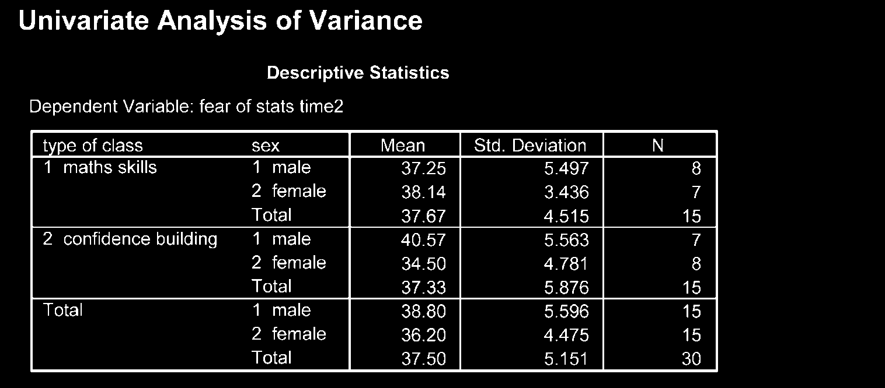
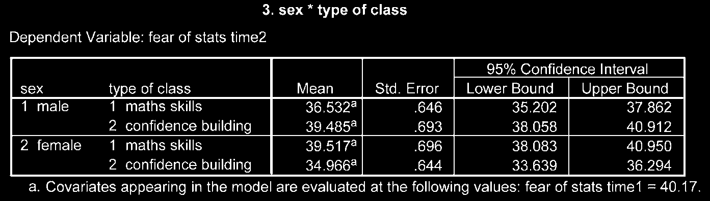

# Phân Tích Hiệp Phương Sai (ANCOVA)

Phân tích hiệp phương sai (Analysis of Covariance - ANCOVA) được sử dụng để so sánh giá trị trung bình giữa các nhóm sau khi **loại bỏ ảnh hưởng biến thiên của một biến liên tục nhiễu (được gọi là Covariate - Biến hiệp biến)**.

---

## 1. Ví Dụ Ứng Dụng

So sánh điểm số toán học sau khóa học giữa 3 phương pháp giảng dạy khác nhau, sau khi đã kiểm soát điểm số toán nền đầu vào (Covariate) của học sinh.

---

## 2. Giả Định Quan Trọng Của ANCOVA

Ngoài các giả định ANOVA thông thường, ANCOVA đòi hỏi:

1. **Tính độc lập của Covariate và biến độc lập:** Covariate không bị ảnh hưởng bởi việc chia nhóm.
2. **Sự đồng nhất của các hệ số góc hồi quy (Homogeneity of regression slopes):** Mối quan hệ giữa Covariate và biến phụ thuộc phải tương tự nhau trong tất cả các nhóm.

---

## 3. Các Bước Thực Hiện Trong SPSS

1. **Analyze** $\r\rightarrow$ **General Linear Model** $\r\rightarrow$ **Univariate...**
2. Đưa biến phụ thuộc vào ô _Dependent Variable_.
3. Đưa biến phân nhóm vào ô _Fixed Factor(s)_.
4. Đưa biến nhiễu/nền liên tục vào ô _Covariate(s)_.
5. Chọn nút **Options...**:
   - Đưa biến phân nhóm vào ô _Display Means for_.
   - Tích chọn **Compare main effects** (chọn _Bonferroni_).
   - Tích chọn **Descriptive statistics**, **Estimates of effect size**, **Homogeneity tests**.
6. Nhấn **Continue** $\r\rightarrow$ **OK**.

---

## 4. Phiên Giải Kết Quả Output

1. **Hiệu ứng của Covariate:** Đánh giá dòng Covariate trong bảng _Tests of Between-Subjects Effects_.
2. **Hiệu ứng của biến độc lập sau điều chỉnh:** Đánh giá dòng biến độc lập chính. Nếu $P < .05$, sự khác biệt giữa các nhóm vẫn tồn tại có ý nghĩa ngay cả khi đã kiểm soát Covariate.
3. **Bảng Trung bình đã điều chỉnh (Adjusted Means / Estimated Marginal Means):** So sánh giá trị trung bình mới của từng nhóm sau khi đã kiểm soát biến hiệp biến.
